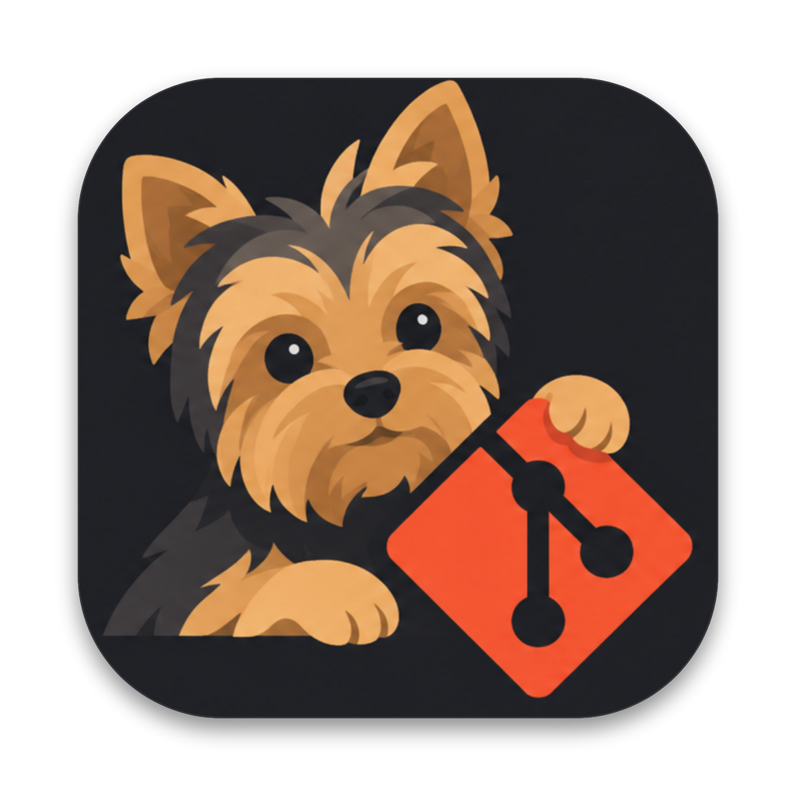

<p align="center">
  
</p>

<h1 align="center">GitDog</h1>

<p align="center">
  Cliente Git de escritorio para macOS con <b>varias cuentas de GitHub</b>.<br />
  Cambia de cuenta con un clic y mantén cada proyecto con su cuenta, sin confundirte.
</p>

---

## Qué hace

- **Varias cuentas**: el botón con el icono `⇄` (arriba a la derecha) cambia de cuenta o agrega otra.
- **Proyectos por cuenta**: agrega carpetas locales o clona repositorios de la cuenta activa.
- **Cada proyecto usa su cuenta**: push, pull y clone usan solo el token de esa cuenta. Los commits salen con su nombre y correo.
- **Día a día**: cambios, diff, commit, push, pull, ramas e historial.
- **Ramas**: al cambiar de rama con cambios pendientes, pregunta si los dejas o los llevas. Al crear una rama, pregunta si sale de la actual o de `main`.
- **Tags**: crear (simples o anotados), subir, eliminar.
- **Pull requests**: ver la lista, los archivos con su diff y la conversación. Crear PRs, dejar revisiones (aprobar, comentar, solicitar cambios) y fusionar.
- **Publicar**: convierte una carpeta local en un repositorio nuevo de la cuenta activa.

## Descargar e instalar (sin código)

Ve a la sección **[Releases](../../releases/latest)** de este repositorio y descarga el instalador para tu Mac:

| Tu Mac | Archivo |
| --- | --- |
| Apple Silicon (M1, M2, M3, M4…) | `GitDog-<versión>-arm64.dmg` |
| Intel | `GitDog-<versión>-x64.dmg` |

Para saber cuál tienes: menú  → **Acerca de este Mac**. Si dice "Chip: Apple…", es Apple Silicon. Si dice "Procesador: Intel…", es Intel.

1. Abre el `.dmg`.
2. Arrastra **GitDog** a la carpeta **Aplicaciones**.
3. Abre GitDog desde Launchpad o Spotlight.

### Aviso la primera vez que lo abres

GitDog no está firmado con una cuenta de Apple Developer, ni notarizado. macOS muestra una advertencia la primera vez. Es normal. Hay dos formas de abrirlo:

- **Clic derecho** sobre GitDog en Aplicaciones, elige **Abrir** y confirma. Solo hace falta una vez.
- O, en la Terminal:

  ```bash
  xattr -cr /Applications/GitDog.app
  ```

Instala solo instaladores que descargues de este repositorio.

## Conectar una cuenta

Abre GitDog y pulsa **Conectar cuenta de GitHub**.

**Con token (funciona siempre).** La app muestra los pasos. En resumen:

1. Entra en github.com con la cuenta que quieres agregar.
2. Foto de perfil → **Settings** → **Developer settings** → **Personal access tokens** → **Tokens (classic)** → **Generate new token (classic)**.
3. En **Note** escribe `GitDog`, elige **No expiration** y marca el permiso `repo`.
4. Pulsa **Generate token**, copia el texto `ghp_…` y pégalo en GitDog.

Atajo: la app tiene un botón que abre esa página con `repo` ya marcado.

Para agregar otra cuenta, cambia de cuenta en GitHub (en el navegador), crea su token y repite.

**Con el navegador (opcional).** Si tienes una OAuth App de GitHub con "Device Flow" activado, pasa su Client ID al arrancar:

```bash
GITDOG_CLIENT_ID=tu_client_id npm run dev
```

Con eso aparece el botón **Iniciar sesión con GitHub**. Se crea en GitHub → Settings → Developer settings → OAuth Apps. No hace falta el secret.

### Qué permite el permiso `repo`

Clone, pull, push, crear repos, ramas, tags, pull requests (crear, revisar, fusionar) e issues.
No permite cambiar archivos de `.github/workflows/` (hace falta el permiso `workflow`), ni borrar repositorios, ni administrar organizaciones.
En organizaciones con SAML SSO, autoriza el token para esa organización desde la lista de tokens de GitHub (**Configure SSO**).

## Para desarrolladores

### Requisitos

- macOS
- [Node.js](https://nodejs.org) 18 o superior (recomendado 20)
- Git (`git --version`)

### Instalar y ejecutar

```bash
git clone <url-de-este-repositorio>
cd GitDog
npm install
npm run dev
```

`npm run dev` abre la app de escritorio en modo desarrollo:

- Los cambios en la interfaz (`src/renderer`) se ven al guardar.
- Los cambios en `src/main` o `src/preload` reinician la app solos.
- Solo reinicia el comando si cambias `package.json` o `electron.vite.config.ts`.

### Scripts

| Comando | Qué hace |
| --- | --- |
| `npm run dev` | App en modo desarrollo, con recarga |
| `npm run build` | Compila la app en `out/` |
| `npm run typecheck` | Revisa los tipos de TypeScript |
| `npm run dist` | Genera los instaladores `.dmg` en `dist/` |
| `npm run icon` | Regenera el icono desde `resources/icon-source.png` |

### Generar el instalador

```bash
npm run dist
```

Crea dos archivos en `dist/`: `GitDog-<versión>-arm64.dmg` (Apple Silicon) y `GitDog-<versión>-x64.dmg` (Intel). La app se firma "ad hoc", sin certificado, así que cualquier persona puede generar el instalador sin cuenta de Apple Developer. Por eso macOS muestra el aviso descrito arriba.

Para quitar el aviso hace falta una cuenta de Apple Developer (99 USD al año) con firma **Developer ID** y notarización.

### Publicar una versión

Los instaladores no se suben al código del repositorio (`dist/` está en `.gitignore`). Se adjuntan a un **Release** de GitHub, y de ahí los descarga la gente.

1. Sube el número de `version` en `package.json`.
2. `npm run dist`
3. Crea el release y adjunta los dos `.dmg`. Con la CLI de GitHub:

   ```bash
   gh release create v0.1.0 dist/GitDog-0.1.0-arm64.dmg dist/GitDog-0.1.0-x64.dmg \
     --title "GitDog 0.1.0" --notes "Primera versión"
   ```

   También puedes hacerlo desde la web: **Releases** → **Draft a new release** → arrastra los dos archivos.

### Cómo funciona

- Cada cuenta guarda su token cifrado con el Keychain de macOS (`safeStorage`), en `secrets.json`.
- Cada proyecto pertenece a una cuenta. Para push, pull y clone, GitDog pasa el token de esa cuenta con `GIT_ASKPASS` y desactiva los credential helpers. No modifica tu `~/.gitconfig`.
- Los commits y tags anotados usan el nombre y el correo de la cuenta del proyecto, con `git -c user.name=… -c user.email=…`.
- Los remotos SSH de GitHub se reescriben a HTTPS durante push, pull y clone, para usar el token.
- "Dejar mis cambios" al cambiar de rama usa `git stash` con el mensaje `gitdog:<rama>`. Al volver a esa rama aparece **Restaurar cambios**.
- `config.json` (cuentas y proyectos, sin secretos) está separado de `secrets.json`. Así se podrá sincronizar entre Macs sin copiar tokens.

Los datos están en `~/Library/Application Support/GitDog/`. Para empezar de cero, cierra la app y borra esa carpeta.

### Estructura

```
src/main        Proceso principal de Electron
  git.ts          Comandos de git
  github.ts       API de GitHub (repos, PRs, revisiones, merge)
  oauth.ts        Login por navegador (device flow)
  store.ts        Cuentas, proyectos y tokens
  ipc.ts          Puente entre la interfaz y el proceso principal
src/preload     Puente seguro hacia la interfaz
src/shared      Tipos y lista de métodos de la API
src/renderer    Interfaz en React
resources       Icono de la app
scripts         Icono, nombre en desarrollo y firma del instalador
```

Para agregar una función: define el método en `src/shared/types.ts` (interfaz `Api` y `API_METHODS`), impleméntalo en `src/main/ipc.ts`, y úsalo desde la interfaz con `window.api`.

## Solución de problemas

| Problema | Solución |
| --- | --- |
| macOS dice que GitDog "está dañado" o "no se puede abrir" | `xattr -cr /Applications/GitDog.app` o clic derecho → **Abrir** |
| "Token inválido o expirado" | Crea un token nuevo y vuelve a conectar la cuenta |
| Error 403 o 404 en un repo de una organización | Autoriza el token para SSO, o pide acceso al repo |
| Push rechazado en `.github/workflows/` | Añade el permiso `workflow` al token |
| El Dock dice "Electron" en modo desarrollo | Cierra la app, ejecuta `killall Dock` y abre `npm run dev` otra vez |

## Pendiente

- Comentarios sobre líneas concretas del diff en las revisiones.
- Sincronizar cuentas y proyectos entre Macs (iCloud).
- Resolver conflictos de merge dentro de la app.

## Autor

Desarrollado por **Luis Felipe**. Escríbeme: [luisfevq+gitdog@gmail.com](mailto:luisfevq+gitdog@gmail.com).
